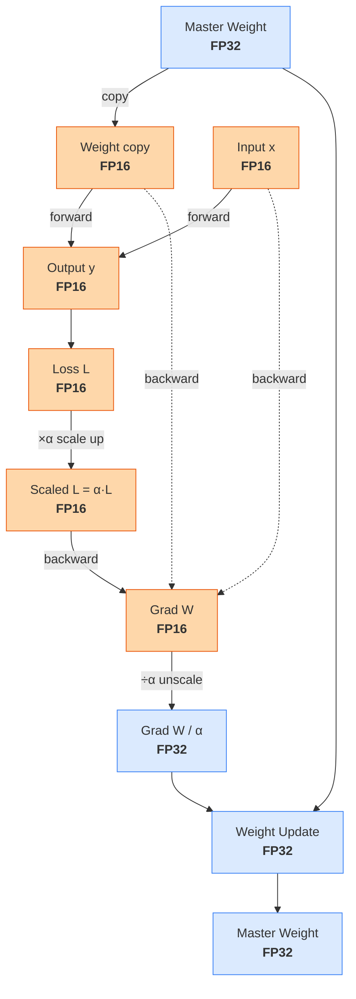

> 本笔记参考了 [AISystem开源课程](https://infrasys-ai.github.io/aisystem-docs/02Hardware04NVIDIA/01BasicTC.html#id3)。

**混合精度训练 (mixed-precision training)** 通过在模型训练过程中使用不同的数值精度来达到加速训练和减少内存消耗的目的。其核心思想在于：

* **低精度计算**：前向传播和反向传播时，使用较低的精度 (e.g., `float16`)。
* **高精度参数**：16 位浮点数的范围和精度有限。为了维持训练稳定性和模型性能，使用高精度来保存和更新模型参数 (e.g. `float32`)。
* **损失缩放**：将 loss 乘上一定倍率，使梯度相应变大，防止梯度下溢。

> [!note]
> 本文以 `float16` 作为低精度浮点类型。实践中，更推荐使用 `bfloat16`，因为其表示范围更大。

具体而言，模型的权重始终以 `float32` 形式存储；这份高精度的权重被称作**master weight**。混合精度训练每一轮的执行过程为：

1. 基于当前 master weight 获取一份 `float16` 的权重副本。master weight 仍保留在内存中。
2. 用 `float16` 的权重和激活值执行前向传播，得到 `float16` 的 loss。
3. 施加损失缩放，将 loss 放大 $\alpha$ 倍。

$$
\tilde{L}=\alpha L \ .
$$

4. 使用放缩后的 loss、权重和中间激活值 (均是 `float16`) 完成反向传播，得到 `float16` 梯度。此时的梯度值是常规梯度值的 $\alpha$ 倍（见下式），故不容易下溢。

$$
\tilde{\mathbf{G}}=\frac{\partial \tilde{L}}{\partial \mathbf{W}}=\frac{\partial \alpha L}{\partial\mathbf{W}}=\alpha\frac{\partial L}{\partial \mathbf{W}}=\alpha \mathbf{G}\ ,
$$

5. 将 `float16` 梯度 $\tilde{\mathbf{G}}$ 转化为 `float32` 梯度，随后除以 $\alpha$ 做反缩放。`float32` 可以表示更小的数，所以除以 $\alpha$ 后也不容易下溢。
6. 用 `float32` 梯度更新 `float32` master weight。

换言之，只有 master weight 以及 master weight 的更新量采用 `float32` 表示；其余的临时权重、激活值等张量全部采用 `float16` 表示。

