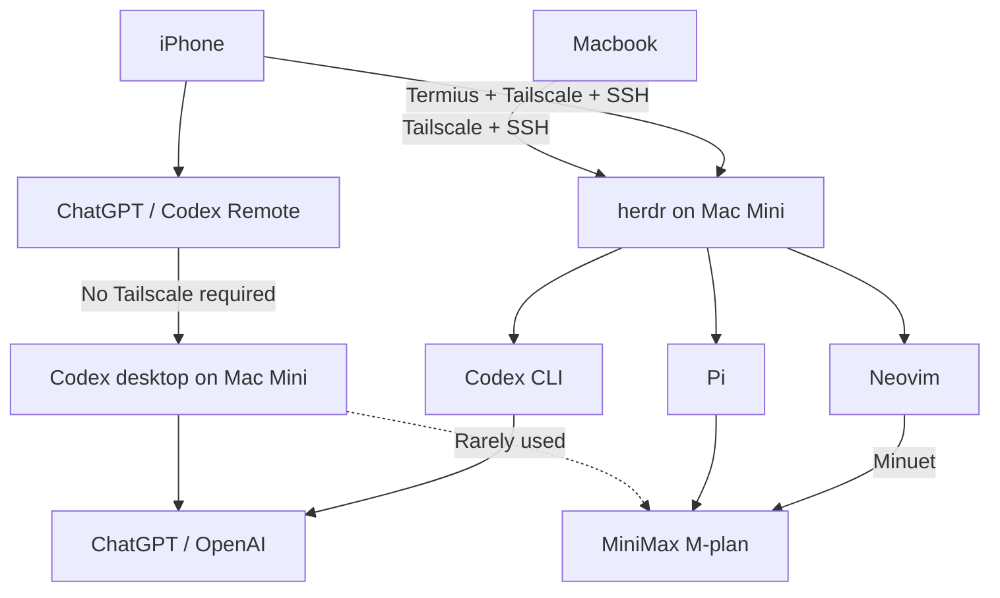

A living document of my tool stack.

## Devices

**Macbook Pro (M1)**

**Mac Mini (M2)**

## Environment

**[Apple Container](https://github.com/apple/container)**

- Linux containers on macOS
- Occasional use

**[uv](https://docs.astral.sh/uv/)**

- Python project and environment management
- Replacing `pip`, `conda` or `pyenv`

## Editing

**[Neovim](https://neovim.io/)**

- Lua configuration in my dotfiles repository
- Python: basedpyright and Ruff
- Markdown: marksman and render-markdown
- LaTeX: VimTeX + texlab; Tectonic builds on save
- blink.cmp completion; Minuet ghost text with MiniMax
- SSH + tmux remote editing, with OSC52 clipboard
- WakaTime activity tracking

**[Obsidian](https://obsidian.md/)**

- Markdown-based knowledge management
- Tech notes, research notes, and personal documentation
- Publish notes to [my personal website](https://allenyolk.github.io/) through **[Quartz](https://quartz.jzhao.xyz/)**

**[tectonic](https://tectonic-typesetting.github.io/)**

- Self-contained LaTeX engine
- Fetches LaTeX packages on demand

## Terminal

**[Ghostty](https://ghostty.org/)**

- GPU-accelerated terminal emulator
- Modern features & smooth rendering

**[herdr](https://github.com/herdrdev/herdr)**

- Terminal sessions for CLI agents
- I use it heavily and highly recommend it
- Persistent sessions for remote work

**[Zsh](https://www.zsh.org/) + [Oh My Zsh](https://ohmyz.sh/)**

- Customizable shell with plugins and themes
- Sync dotfiles through GitHub

## AI

**[Codex](https://openai.com/codex/)**

- My main coding tool: desktop first, CLI as a complement
- Refactoring, code review, and documentation
- [Remote](https://learn.chatgpt.com/docs/remote) through the ChatGPT mobile app to my connected Mac
- No Tailscale needed for Codex Remote; the Mac must stay awake and online
- MiniMax is also configured, but rarely used here

**[Pi](https://pi.dev/)**

- My CLI entry point for non-GPT models
- Transparent internals and customizable plugins
- I build plugins and contribute to the community
- gotgenes' subagent plugin for delegated tasks
- [pi-minimal-display](https://github.com/AllenYolk/pi-minimal-display): compact tool output
- [pi-delete](https://github.com/AllenYolk/pi-delete): delete a session on exit

**Providers**

- ChatGPT (OpenAI)
- MiniMax M-plan

## Network

**[Tailscale](https://tailscale.com/)**

- Private networking across my devices
- Tailscale + [macOS Screen Sharing](https://support.apple.com/en-sg/guide/mac-help/mh14066/mac): Macbook to Mac Mini
- Tailscale + SSH: direct access to Pi and other terminal tools on my Mac Mini
- Ghostty on my Macbook; [Termius](https://termius.com/) on my iPhone
- SSH + Neovim keeps repositories on the Mac Mini

## Summary

